# 🧠 Twitter Reflection Agent

A **LangGraph-powered AI agent** that generates and refines high-quality, viral Twitter posts through an automated **generate-reflect-refine** cycle. Powered by **Google Gemini 2.5 pro**, this agent mimics the behavior of a top-tier Twitter influencer—brainstorming, critiquing, and improving content iteratively.

---

## 🎯 Overview

This project implements a sophisticated agent workflow using LangGraph. It autonomously generates Twitter posts, reflects on their quality, and improves them across several iterations, ensuring maximum virality and engagement.

---

## ✨ Features

* 🔁 **Iterative Improvement**: Automatically refines tweets through multiple generate-reflect cycles.
* 🔥 **Viral Content Focus**: Optimized for creating highly engaging, share-worthy tweets.
* 🧠 **Intelligent Stopping**: Automatically halts after 4 full reflection cycles (8 messages).
* 🔧 **Modular Design**: Clean separation of chains and graph logic for maintainability.
* 🤖 **Gemini 2.5 Flash**: Utilizes Google’s powerful LLM for fast and intelligent generation.
* 🧵 **Conversation Memory**: Maintains message history for better context and improvements.
* 📈 **Graph Visualization**: Supports Mermaid and ASCII visualizations of the workflow.

---

## 🛠️ Installation

```bash
git clone https://github.com/alokv0521/Twitter-Reflection-Agent-
cd twitter-reflection-agent
pip install -r requirements.txt
```

### 🔐 Set Up Environment Variables

Create a `.env` file in the root directory and add your Google Gemini API key:

```env
GOOGLE_API_KEY=your_google_gemini_api_key_here
```

---

## 🚀 Usage

### Basic Usage

```python
from graph import app
from langchain_core.messages import HumanMessage

response = app.invoke(HumanMessage(content="write the complete description about the topic you want to ask for"))
print(response)
```

### See Full Iterative Conversation

```python
for message in response:
    print(f"{message.__class__.__name__}: {message.content}")
    print("-" * 50)
```

---

## 🧠 How It Works

The reflection agent follows this feedback loop:

1. **GENERATE**: Produce a tweet based on user prompt.
2. **REFLECT**: Critique the generated tweet for improvements.
3. **GENERATE**: Rewrite using reflection feedback.
4. **Repeat**: Continue until 4 cycles or 8 total messages are generated.

```mermaid
graph TD
    A[Start] --> B[GENERATE Node]
    B --> C{should_continue}
    C -->|len ≤ 8| D[REFLECT Node]
    C -->|len > 8| E[END]
    D --> B
```



---

## 📁 Project Structure

```
twitter-reflection-agent/
├── graph.py          # LangGraph workflow definition
├── chains.py         # Prompt logic and LLM chains
├── .env              # API keys and secrets (user-created)
├── requirements.txt  # Python dependencies
└── README.md         # Project documentation
```

---

## ⚙️ Configuration

### ⭮️ Adjust Iteration Limit

Edit the `should_continue` function in `graph.py`:

```python
def should_continue(state):
    if(len(state) > 8):  # Max 8 messages (4 full cycles)
        return "END"
    return "REFLECT"
```

### 🧠 Change the LLM

In `chains.py`, replace the model as needed:

```python
llm = GoogleGenerativeAI(model="gemini-2.5-pro")
```

### 📝 Customize Prompts

Update `generation_prompt` and `reflection_prompt` in `chains.py` to fit different tones, formats, or content types.

---

## 📊 Example Output

**Input Prompt**: "AI Agents taking over content creation"

```
Iteration 1 - Generate:
"🤖 AI agents are revolutionizing content creation! From writing to design, they're becoming our creative partners. The future is collaborative, not replacement."

Iteration 1 - Reflect:
"Good start! Use a stronger hook and controversial angle. Try adding statistics and a call-to-action."

Iteration 2 - Generate:
🚨 BREAKING: AI agents just wrote 40% of this year's viral content and you didn't even notice. Are we witnessing the death of human creativity or its evolution? Thread below 👇
```

---

## 🔍 Visualize the Graph

```python
print(app.get_graph().draw_mermaid())
app.get_graph().print_ascii()
```

---

## 🧪 Testing

```python
app.invoke(HumanMessage(content="The future of blockchain technology"))
app.invoke(HumanMessage(content="Remote work productivity tips"))
app.invoke(HumanMessage(content="Latest developments in quantum computing"))
```

---

## 🤝 Contributing

1. Fork the repository
2. Create a feature branch: `git checkout -b feature/amazing-feature`
3. Commit your changes: `git commit -m 'Add amazing feature'`
4. Push to your branch: `git push origin feature/amazing-feature`
5. Open a Pull Request 🎉

---

## 🔧 Troubleshooting

| Problem               | Solution                                                     |
| --------------------- | ------------------------------------------------------------ |
| API Key Not Found     | Make sure `.env` file is created and loaded                  |
| Import Errors         | Reinstall dependencies via `pip install -r requirements.txt` |
| Mermaid Not Rendering | Use ASCII graph instead (function available)                 |

---

## 📋 Requirements

```
langchain-core>=0.1.0
langchain-google-genai>=1.0.0
langgraph>=0.1.0
python-dotenv>=1.0.0
```

---

## 📝 License

This project is licensed under the [MIT License](LICENSE).

---

## 🙏 Acknowledgments

* [LangGraph](https://github.com/langchain-ai/langgraph)
* [Google Generative AI](https://makersuite.google.com/)
* Inspired by **reflection patterns** in LLM-based agents
* Built with ❤️ to make your tweets go viral 🚀
